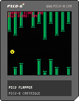

### about this game

this is a clone of flappy bird that I made with some guidance from "Game Development with Pico-8" by Dylan Bennet in a single day.  It was largely an exercise in programming practice.

I tried to pay attention to the token count of my code (an important aspect of pico-8 programs), though, I failed in that respect when it came to the collision code.

### future features
1. ~~high score in game~~
2. saved high score
3. sound effects
4. music (during gameplay and on game over screen)
5. more optimized code
6. selectable difficulty

